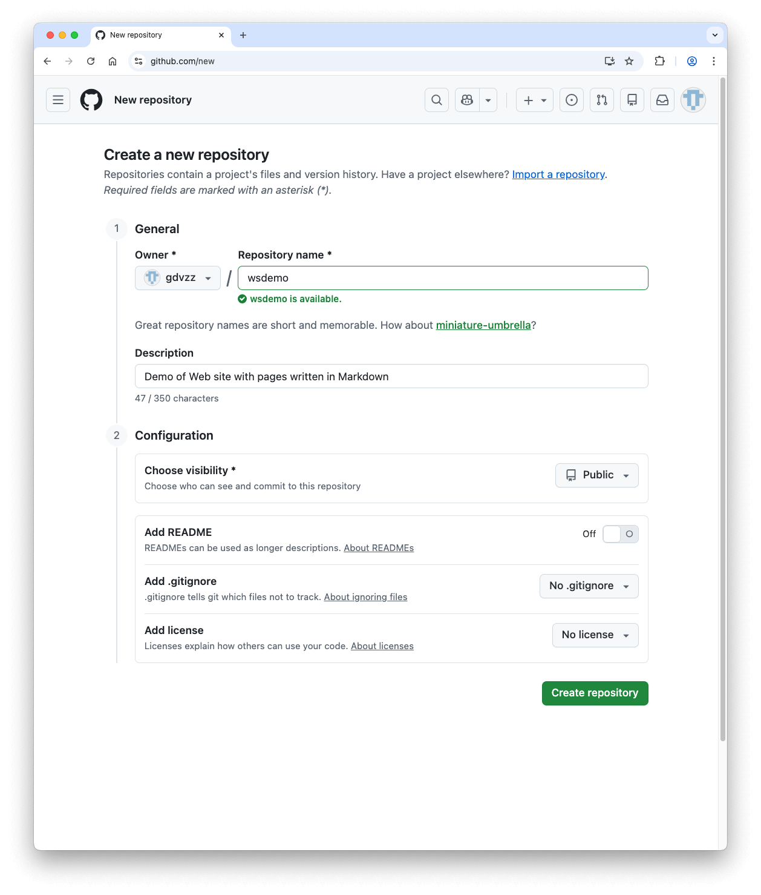

# 用 Github + Markdown 创建个人网站

本文档描述如何通过 Github + Markdown 创建网站。大致步骤如下：
1. 在 github 上创建 **账号 account**。已有账号了，可跳过此步骤。以下以账号 gdvzz 为例。
<!--  -->
2. 在 github 账号下新建 **仓库 repository**，用于存放网站的文档、图片等内容。以下以仓库 wsdemo 为例。
<!--  -->
3. 在 github 账号下添加 **SSH key**（以保证只有你能更新网站的内容）：
    - 在本地电脑生成 SSH key
    - 在本地电脑配置 github 主机信息
    - 在本地电脑测试是否能通过 ssh 连接到 github 账号
<!--  -->
4. 在本地电脑配置 github 仓库信息（以便从本地电脑不断更新网站内容）：
    - 初始化本地电脑目录
    - 配置 github 仓库信息

## 网站效果

请访问：[https://gdvzz.github.io/wsdemo/](https://gdvzz.github.io/wsdemo/)

## 在 github 上创建账号 account

登录 github 网站后新建**仓库（repository）**:
- 输入**仓库名称（Repository name）**，比如 `wsdemo`
- 可以写一些**描述（Description）**
- **Choose visibility**：`Public`

然后按底部按钮 **Create repository** 即可。如下图所示：
[](./readme.assets/new_repo.png)

## 在 github 账号下添加 SSH key

```
# github - gdvzz@outlook.com
Host githubvzz.com
  HostName github.com
  User git
  IdentityFile ~/.ssh/id_ed25519_gdvzz_olk
```

```bash
~ % ssh -T git@githubvzz.com
Hi gdvzz! You've successfully authenticated, but GitHub does not provide shell access.
```

## 在本地电脑配置 github 仓库信息

```bash
~ % mkdir -p gdvzz/wsdemo
```

```bash
~ % cd gdvzz/wsdemo
~/gdvzz/wsdemo % git init
Initialized empty Git repository in /Users/george1442/gdvzz/wsdemo/.git/
```
在 `~/gdvzz/wsdemo/docs` 目录中，编辑生成文档 `README.md`。

```bash
~/gdvzz/wsdemo % git status
~/gdvzz/wsdemo % git add .
~/gdvzz/wsdemo % git branch -M master
~/gdvzz/wsdemo % git remote add origin git@githubvzz.com:gdvzz/wsdemo.git
~/gdvzz/wsdemo % git push -u origin master
Enumerating objects: 4, done.
Counting objects: 100% (4/4), done.
Delta compression using up to 4 threads
Compressing objects: 100% (2/2), done.
Writing objects: 100% (4/4), 1000 bytes | 1000.00 KiB/s, done.
Total 4 (delta 0), reused 0 (delta 0), pack-reused 0
To githubvzz.com:gdvzz/wsdemo.git
 * [new branch]      master -> master
branch 'master' set up to track 'origin/master'.
```

## 更新网站


## 编写说明

- **图片**
  - 建议使用 tinyPNG 压缩，上传压缩后的版本到个人网站。tinyPNG：[中文官网](https://tinify.cn/)，[英文官网](https://tinypng.com/)。
  - 压缩后效果几乎不变，但图片文件变小了，在打开网站显示时会更快。

## 其他说明

1、校园网内访问 github，时灵时不灵。当连接不上时，可尝试断开校园网的 wifi 后再重连，一般就可以了。本文档涉及的 github 相关操作，都是连校园网的 wifi 完成的。